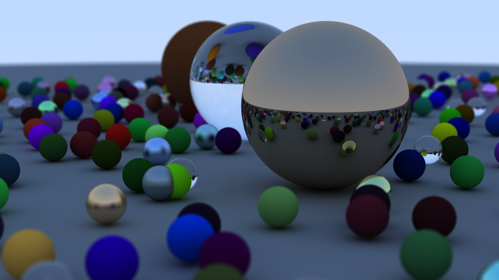

# Ray-tracing

It is my realise by raytracing book.

## Run

- Run code in cpp

```bash
make cpp
```

- [WIP] Run code in rust-lang

```bash
make rs
```

## Result



## Reference

[_Ray Tracing in One Weekend_](https://raytracing.github.io/books/RayTracingInOneWeekend.html)
